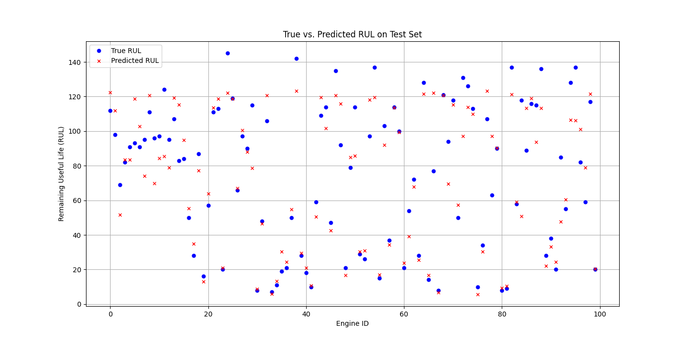

# Deep Prognostics for Turbofan Engines

## 1. Project Overview

This project addresses the critical industrial problem of unexpected equipment failure, which can lead to significant financial losses and production downtime. By leveraging deep learning techniques, this project builds an intelligent system to monitor equipment health and predict its Remaining Useful Life (RUL).

Based on the publicly available NASA C-MAPSS dataset for turbofan engines, this repository provides a complete end-to-end workflow, from data preprocessing and feature engineering to model training and evaluation. The final results demonstrate the effectiveness of using LSTMs for predictive maintenance tasks.

**Core Value Proposition**: To provide data-driven decision support for businesses, shifting maintenance strategies from reactive ("fix after failure") to proactive ("predict and prevent"), thereby reducing costs, increasing efficiency, and ensuring operational safety.

## 2. Key Results

After 100 epochs of training, our LSTM model achieved strong predictive performance on the unseen test set.

* **Root Mean Squared Error (RMSE) on Test Set**: **16.56**
* **Prediction Results vs. Ground Truth**: 

   

The plot above shows a clear positive correlation between the predicted RUL (red 'x') and the true RUL (blue 'o'), confirming that the model has successfully learned the degradation patterns from the time-series data.

## 3. Tech Stack

* **Language**: Python 3.9
* **Core Libraries**: PyTorch, Pandas, NumPy, Scikit-learn, Matplotlib

## 4. How to Run

1.  **Clone the Repository**
    ```bash
    git clone [https://github.com/Shuai-fa/Deep-Prognostics-for-Engines.git](https://github.com/Shuai-fa/Deep-Prognostics-for-Engines.git)
    cd Deep-Prognostics-for-Engines
    ```

2.  **Create and Activate Conda Environment**
    ```bash
    # Create the environment
    conda create --name prognostics_env python=3.9
    # Activate the environment
    conda activate prognostics_env
    ```

3.  **Install Dependencies**
    ```bash
    # Install a compatible version of NumPy
    pip install "numpy<2.0"
    # Install other core libraries
    pip install pandas matplotlib scikit-learn torch torchvision torchaudio
    ```

4.  **Download Data**
    Download the C-MAPSS dataset from a source like [Kaggle](https://www.kaggle.com/datasets/behrad3d/nasa-cmaps-dataset). After unzipping, place the following files into the root directory of this project:
    * `train_FD001.txt`
    * `test_FD001.txt`
    * `RUL_FD001.txt`

5.  **Run the Project**
    ```bash
    # Run the model training script (this will generate lstm_model.pth)
    python train_model.py

    # Run the evaluation script (this will use the trained model and generate the results plot)
    python evaluate_model.py
    ```

## 5. Methodology

The project workflow is divided into the following key steps:
1.  **Data Exploration and Preprocessing**: The raw C-MAPSS time-series data was loaded, visualized, and cleaned. The RUL for the training set was calculated to serve as the ground truth label.
2.  **Feature Engineering**: Multi-dimensional sensor data was normalized using Min-Max scaling. A sliding window technique was applied to transform the time-series data into supervised learning samples suitable for LSTMs.
3.  **Model Architecture and Training**: A two-layer LSTM network was constructed, using the Adam optimizer and Mean Squared Error (MSE) loss for end-to-end training.
4.  **Model Evaluation**: The trained model's performance was validated on an independent test set. RMSE and visualization plots were used to quantify its predictive accuracy.

## 6. Future Improvements

* Experiment with more advanced architectures like GRUs or Transformers.
* Incorporate more sophisticated feature engineering, such as frequency-domain features using FFT.
* Deploy the trained model as a REST API for real-time predictions.
* Build an interactive dashboard using Streamlit or Gradio to visualize equipment health.